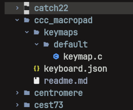

# CCC macropad

## Installation

### QMK Cli
This is just a quick recap. When you get stuck, check the official qmk documentation [here](https://docs.qmk.fm/newbs_getting_started)
In order to get QMK installed on your system run
'python3 -m pip install qmk'
Test if installation was successfull:
'qmk --version'
If everything works run:
'qmk setup'
this will install the qmk firmware
submit prompts with 'y'

You should now have QMK setup in '~/qmk_firmware'.

### Create new layout
`cd ~/qmk_firmware/keyboards
qmk new-keyboard`

follow the instructions. when it comes to the board, choose, 
->non of the above layouts
->15. promicro_rp2040

your new keyboard's setup should now be created in 
~/qmk_firmware/keyboards/<your_keyboards_name_folder>

in you keyboard.json:
add:
'"via": true' to the features

the keyboard.yaml holds the actual layout of the keyboard as well as some more metadata.
keymaps can hold different configurations for this layout.
after configuring your keymap to your liking, you can always try to compile and see if you keymap.c and you kayboard.yaml align:

`qmk compile -kb <keyboard> -km <keymap>`
if not defined differently you keymap is just 'default'

### Flashing your MCU
Once you are ready to flash qmk to your microcontroller (rp2040 in this case), plug it in and set it into bootloader mode.
In our case that requires pressing the boot button while plugging it in. The device should show up as a flashable media in your files-explorer.
run:

`qmk flash -kb <keyboard> -km <keymap>`
